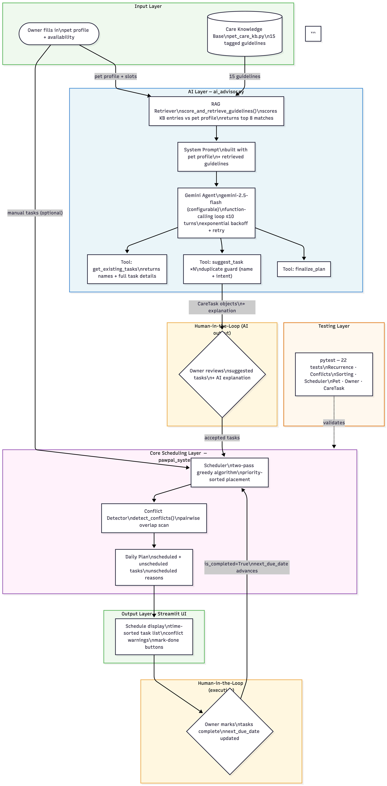

# PawPal+: Intelligent Pet Care Scheduler

**PawPal+** is a Python web application that helps pet owners plan and optimise their pet's daily care by combining a smart scheduling engine with an agentic AI advisor powered by Google Gemini.

Pet care is easy to let slip when life gets busy. Medication timings get missed, walks get skipped, and grooming falls behind. PawPal+ solves this by taking a pet's profile and the owner's available time, retrieving relevant veterinary care guidelines through a RAG pipeline, and using an AI agent to suggest a personalised task list. A two-pass greedy scheduling algorithm then fits every task into the owner's day, prioritising medication and time-critical care above everything else. The result is a clear, conflict-free daily schedule the owner can act on and mark complete, with recurring tasks resurfacing automatically the next day or week.

---

## Original Project

PawPal+ was originally built as a deterministic pet care scheduling system with no AI components, developed across Modules 1 and 2. Its goal was to help pet owners organise daily care tasks by automatically fitting them into available time slots using a two-pass greedy scheduling algorithm that respected task priorities, preferred time windows, and recurring frequencies. The system included automatic conflict detection between overlapping tasks, auto-generated tasks based on pet profile rules, and a 22-test automated suite covering scheduling correctness, recurrence logic, and conflict classification.

---

## System Diagram



The system is organised into five layers. The input layer is where the owner enters their pet's profile and availability, and where the care knowledge base of 23 veterinary guidelines lives. The AI layer runs first: the RAG retriever scores every guideline against the pet's species, age, medical conditions, and body condition score, then injects the top 8 matches into Gemini's system prompt. Gemini then runs in a function-calling loop, calling get_existing_tasks to observe the schedule, plan_reasoning to articulate its gap analysis, suggest_task for each new recommendation, and finalize_plan to wrap up with a natural language explanation. The human-in-the-loop step lets the owner review and accept or reject each suggestion before anything is committed to the schedule. The accepted tasks then pass into the core scheduling layer, where the two-pass greedy algorithm places them into the owner's available time slots by priority, detects any conflicts, and produces a DailyPlan. The owner sees the final schedule in the Streamlit UI, can mark tasks complete, and recurring tasks resurface automatically. A separate evaluation harness validates all deterministic components without any API calls.

---

## Setup

### 1. Clone and create a virtual environment

```bash
git clone <repo-url>
cd applied-ai-system-project

python3 -m venv .venv
source .venv/bin/activate        # Windows: .venv\Scripts\activate
```

### 2. Install dependencies

```bash
python3 -m pip install -r requirements.txt
```

### 3. Add your Gemini API key

Copy the example env file and fill in your key:

```bash
cp .env.example .env
```

Then open `.env` and replace `your_api_key_here` with your key from [aistudio.google.com/app/apikey](https://aistudio.google.com/app/apikey). The app loads this file automatically on startup — you do not need to export anything in your shell.

### 4. Run the app

Always launch Streamlit through the virtual environment to avoid import errors:

```bash
source .venv/bin/activate && python3 -m streamlit run app.py
```

The app will open at `http://localhost:8501`.

### 5. Run the tests

```bash
python3 -m pytest tests/test_pawpal.py -v
```

### 6. Run the evaluation harness

The eval harness validates the scheduler, RAG retrieval, BCS classifier, and conflict detection against 30 predefined checks with no API calls required:

```bash
python3 eval.py           # summary output
python3 eval.py --verbose # show detail on every check
```

---

## Features

| Feature | How it works |
|---|---|
| **AI Care Advisor** | Gemini analyses the pet's profile, retrieves relevant care guidelines from the knowledge base (RAG), and uses an agentic tool-use loop to suggest a personalised task list with explanations. |
| **Two-pass greedy scheduling** | Tasks are sorted by priority score and placed into the owner's availability slots. Pass 1 respects each task's preferred time window; Pass 2 relaxes that constraint so high-priority tasks are never silently dropped. |
| **Priority scoring** | `CareTask.get_priority_score()` computes `base_priority × 10`, adds `+20` for fixed-time tasks, and `+15` for medication tasks, ensuring critical care always schedules first. |
| **Sorting by time** | `Scheduler.sort_by_time()` orders any task list chronologically by `scheduled_start_minute`; falls back to parsing the `HH:MM` time string when that field is `None`. |
| **Conflict warnings** | `Scheduler.detect_conflicts()` scans the plan pairwise and returns `ConflictReport` objects that classify each time overlap as same-pet or cross-pet, without raising exceptions. |
| **Daily recurrence** | `mark_complete(on_date)` sets `next_due_date` to `on_date + 1 day`; the scheduler skips any task whose `next_due_date` is in the future, so completed tasks reappear automatically the next day. |
| **Twice-daily expansion** | Tasks with `frequency="twice_daily"` are split into separate AM and PM instances using `dataclasses.replace()`, each placed into its own time window. |
| **Weekly recurrence** | Tasks with `frequency="weekly"` are pinned to a specific weekday via `scheduled_weekday` and skipped on all other days. `mark_complete` advances `next_due_date` by 7 days. |
| **Auto-generated tasks** | `Pet.get_care_requirements()` automatically adds a training session for dogs under 2, a weekly weight check for cats over 10, and forces feeding tasks to be time-inflexible for pets with medical conditions. |
| **Plan filtering** | `DailyPlan.filter_tasks(pet_name=..., completed=...)` filters the schedule by pet, completion status, or both simultaneously. |

---

## Sample Interactions

### Example 1: Puppy with no medical conditions

**Input:** Golden Retriever, age 1, 12 kg, owner available 07:00-09:00 and 17:00-20:00, no existing tasks.

**Agent planning step:**
- Identified gaps: no exercise tasks, no feeding schedule, no training routine
- Planned suggestions: puppy-appropriate walk, breakfast and dinner feeding, training session, enrichment play
- Priority order: feeding tasks first (priority 5), then training (priority 4), then exercise and enrichment

**AI suggested tasks:** Puppy Walk (15 min, daily, 08:00-09:00), Breakfast (10 min, daily, 07:00-08:00), Dinner (10 min, daily, 17:00-18:00), Training and Socialisation (10 min, daily, 09:00-10:00), Puppy Play Session (15 min, daily, 17:00-18:00)

**Scheduled output:** All 5 tasks placed. Breakfast and Dinner marked time-inflexible and scheduled first. No conflicts detected.

---

### Example 2: Diabetic senior cat

**Input:** Siamese cat, age 13, 4.2 kg, medical condition: diabetes, owner available 07:00-09:00 and 19:00-21:00.

**BCS assessment:** Healthy weight (3.0-5.0 kg range for senior cats).

**RAG top retrieved guidelines:** Care for Diabetic Pets (score 9), Feeding Schedule for Cats, Hyperthyroidism Management, Senior Pet Health Monitoring.

**Agent planning step:**
- Identified gaps: no insulin administration task, no structured feeding tied to medication timing, no senior health monitoring
- Planned suggestions: twice-daily insulin injection at 12-hour intervals after meals, structured breakfast and dinner, weekly weight check
- Priority order: insulin injections are critical (priority 5) and must be time-inflexible

**AI suggested tasks:** Insulin Injection AM (10 min, twice-daily, 07:30-08:00, not flexible), Insulin Injection PM (10 min, 19:30-20:00, not flexible), Breakfast (5 min, daily, 07:00-07:30), Dinner (5 min, daily, 19:00-19:30), Weekly Weight Check (5 min, weekly)

**Scheduled output:** All 5 tasks placed. Insulin injections claimed their fixed windows first. No conflicts detected.

---

### Example 3: Overweight anxious dog (no conditions entered by owner)

**Input:** Beagle, age 4, 18 kg, no medical conditions entered, owner available 07:00-09:00 and 17:00-20:00.

**BCS assessment:** Obese (Beagle medium range is 10-25 kg, but 18 kg is above the 1.1x threshold for medium). Weight Management guidelines auto-injected into RAG without owner input.

**RAG top retrieved guidelines:** Weight Management and Obesity Prevention (auto-injected), Daily Exercise for Adult Dogs, Feeding Schedule for Adult Dogs, Flea and Tick Prevention.

**AI suggested tasks:** Measured Morning Meal (10 min, daily, 07:00-08:00, not flexible), Measured Evening Meal (10 min, daily, 17:00-18:00, not flexible), Morning Walk (30 min, daily, 07:00-09:00), Weekly Weight Check (5 min, weekly)

**Scheduled output:** 4 tasks scheduled. Meals placed first as inflexible. Walk fills remaining morning slot.

---

## Design Decisions

**Two-pass greedy scheduler over backtracking.** A backtracking algorithm would find a globally optimal arrangement, but for a daily schedule with 5–15 tasks it adds complexity with no practical benefit. The two-pass greedy approach — pass 1 respects preferred windows, pass 2 relaxes them — is predictable, fast, and easy to reason about. The trade-off is that it can't recover from a bad early placement, but priority sorting before scheduling means the most critical tasks claim slots first.

**Agentic tool-use loop over structured one-shot generation.** Asking Gemini to emit a fixed JSON object in one call is simpler, but it gives the model no way to inspect what is already on the schedule before making suggestions. The tool-use loop lets the model call `get_existing_tasks` first, then `plan_reasoning` to commit its gap analysis to text, then `suggest_task` for each recommendation. Each step is observable in the logs and the UI. The trade-off is more API turns per run and exposure to rate limits on the free tier.

**BCS auto-injection before RAG scoring.** The body condition classifier runs inside `retrieve_guidelines()` before any scoring happens. This means an obese pet automatically surfaces weight management guidelines even if the owner never mentions weight as a concern. The alternative — surfacing it only as a UI warning — would leave the AI advisor blind to the condition. The trade-off is that the classifier adds a fixed computation cost on every advisor run.

**Dataclasses over Pydantic for core models.** `CareTask`, `Pet`, `Owner`, and `DailyPlan` are plain Python dataclasses. This keeps the scheduling logic dependency-free and the test harness runnable without any third-party packages. Pydantic would add runtime validation but the scheduling layer is internal — validation happens at the UI boundary in Streamlit instead.

---

## Testing

The project has two separate validation layers.

**Automated test suite (`tests/test_pawpal.py`).** 22 pytest tests cover the core scheduling logic across seven classes: task completion and recurrence, owner and pet aggregation, chronological sorting (including `None` fields and midnight wraparound), conflict detection (same-pet, cross-pet, and adjacent tasks that must not be flagged), and end-to-end plan generation. These tests run with no API calls and no external dependencies, validating that the deterministic engine is correct before any AI layer is involved.

**Evaluation harness (`eval.py`).** 30 checks across four sections validate the components that sit between the AI and the scheduler: RAG retrieval returns the right guidelines for each pet profile, the BCS classifier correctly categorises weight status across species and breed sizes, the scheduler respects priority ordering and time windows under capacity constraints, and conflict detection catches overlaps without false positives on adjacent tasks. The harness prints a pass/fail summary and supports `--verbose` for per-check detail.

**What the testing revealed.** Writing the eval harness exposed an edge case in the BCS classifier: the first test used an 18 kg Beagle, which falls within the valid medium-dog range and is correctly classified as healthy, not obese as the test expected. The fix was to choose a weight that clearly exceeds the threshold for the breed size. The broader lesson was that boundary-condition tests need to be designed with the actual threshold values in mind, not intuitive assumptions about what "heavy" means for a given animal.

---

## AI Advisor — how it works

### RAG (Retrieval-Augmented Generation)

`pet_care_kb.py` holds a knowledge base of 23 care guidelines tagged by species, age group, and medical condition. When the advisor runs, `retrieve_guidelines()` scores every entry against the pet's profile:

- **+3** species match
- **+2** age-group match (puppy / adult / senior)
- **+4** medical condition keyword match (substring, case-insensitive)

The top 8 matching entries are embedded directly into Gemini's system prompt so its suggestions are grounded in the retrieved knowledge, not general assumptions.

### Agentic workflow

Gemini is given four tools and runs in a loop until it finalises the plan:

| Tool | Purpose |
|---|---|
| `get_existing_tasks` | Inspect what tasks are already on the schedule |
| `plan_reasoning` | Commit a gap analysis before making any suggestions |
| `suggest_task` | Add a task to the emerging care plan |
| `finalize_plan` | End the loop with a natural-language explanation |

The loop is capped at 10 turns. Transient 429 rate limits are retried automatically with exponential backoff. All API errors (auth failure, quota exhaustion, server errors) are caught and returned as readable error messages — the app never crashes on an API failure.

### Logging

`ai_advisor.py` logs to stdout via Python's `logging` module (`pawpal.ai_advisor` logger). Each run records:
- How many guidelines were retrieved and why
- Every tool call the agent makes and its outcome
- Any warnings (duplicate tasks skipped, unexpected stop reasons)
- Any API errors with full tracebacks

---

## Project structure

```
app.py              Streamlit UI
pawpal_system.py    Core scheduling logic (Pet, CareTask, Owner, Scheduler, DailyPlan)
ai_advisor.py       Gemini-powered agentic advisor with RAG
pet_care_kb.py      Care knowledge base and retrieval function
main.py             CLI demo script
eval.py             Deterministic evaluation harness (30 checks, no API calls)
tests/
  test_pawpal.py    22 automated tests
requirements.txt    Python dependencies
.env.example        Template for API key configuration
```

---

## Tests

The suite contains **22 tests** across seven classes:

| Class | Tests | What is verified |
|---|---|---|
| `TestCareTask` | 2 | `mark_complete` sets `is_completed`; `mark_incomplete` resets it |
| `TestPet` | 2 | Tasks are stored on the pet and returned by `get_care_requirements` |
| `TestOwner` | 2 | Pets are registered; tasks are aggregated across all pets |
| `TestSorting` | 3 | `sort_by_time` orders tasks chronologically; handles `None` field; handles midnight |
| `TestRecurrence` | 6 | `mark_complete` sets correct `next_due_date`; `create_next_occurrence` resets state; scheduler skips/includes by date |
| `TestConflictDetection` | 6 | Overlaps flagged as same-pet or cross-pet; adjacent tasks not flagged; `add_task` rejects overlaps |
| `TestScheduler` | 1 | `generate_daily_plan` schedules a fitting task with nothing unscheduled |

---

## Reflection

The hardest part of this project wasn't the code. It was deciding what the system should actually do before writing a single line. The scheduling algorithm was straightforward once I committed to the two-pass greedy approach, but getting there meant ruling out backtracking, ruling out constraint solvers, and accepting that "good enough in order" beats "optimal but slow" for a daily planner.

Adding AI made that harder, not easier. The first instinct was to ask Gemini for a JSON task list and call it done. That works, but it means the model is generating suggestions with no awareness of what already exists on the schedule. Building the tool-use loop forced me to think about what the model actually needs to know at each step, which turned out to be the more interesting engineering problem.

The BCS classifier was the unexpected favourite. It started as a curiosity — does the system know if an animal is overweight? — and became a meaningful feature. A pet owner might not think to mention their dog is obese because they don't know. Having the system quietly flag it and surface the right care guidelines without being asked felt like the closest the project got to being genuinely useful rather than just technically interesting.

If I built this again, I'd invest more in the evaluation harness earlier. The 30-check eval caught a real classifier bug that the pytest suite didn't cover, simply because it tested boundary values instead of happy paths. Writing tests after the fact is useful; writing tests that force you to think about edge cases before you've convinced yourself the code is correct is better.
