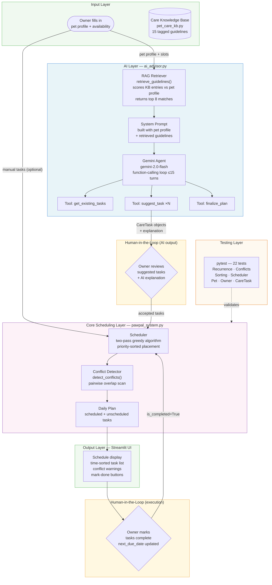

# PawPal+ (Module 2 Project)

**PawPal+** is a Streamlit app that helps a pet owner plan and optimise daily care tasks for their pet, with an AI advisor powered by Claude.

---

## System Diagram



---

## Setup

### 1. Clone and create a virtual environment

```bash
git clone <repo-url>
cd applied-ai-system-project

python3 -m venv .venv
source .venv/bin/activate        # Windows: .venv\Scripts\activate
```

### 2. Install dependencies

```bash
python3 -m pip install -r requirements.txt
```

### 3. Add your Gemini API key

Copy the example env file and fill in your key:

```bash
cp .env.example .env
```

Then open `.env` and replace `your_api_key_here` with your key from [aistudio.google.com/app/apikey](https://aistudio.google.com/app/apikey). The app loads this file automatically on startup — you do not need to export anything in your shell.

### 4. Run the app

```bash
python3 -m streamlit run app.py
```

The app will open at `http://localhost:8501`.

### 5. Run the tests

```bash
python3 -m pytest tests/test_pawpal.py -v
```

---

## Features

| Feature | How it works |
|---|---|
| **AI Care Advisor** | Claude analyses the pet's profile, retrieves relevant care guidelines from the knowledge base (RAG), and uses an agentic tool-use loop to suggest a personalised task list with explanations. |
| **Two-pass greedy scheduling** | Tasks are sorted by priority score and placed into the owner's availability slots. Pass 1 respects each task's preferred time window; Pass 2 relaxes that constraint so high-priority tasks are never silently dropped. |
| **Priority scoring** | `CareTask.get_priority_score()` computes `base_priority × 10`, adds `+20` for fixed-time tasks, and `+15` for medication tasks, ensuring critical care always schedules first. |
| **Sorting by time** | `Scheduler.sort_by_time()` orders any task list chronologically by `scheduled_start_minute`; falls back to parsing the `HH:MM` time string when that field is `None`. |
| **Conflict warnings** | `Scheduler.detect_conflicts()` scans the plan pairwise and returns `ConflictReport` objects that classify each time overlap as same-pet or cross-pet, without raising exceptions. |
| **Daily recurrence** | `mark_complete(on_date)` sets `next_due_date` to `on_date + 1 day`; the scheduler skips any task whose `next_due_date` is in the future, so completed tasks reappear automatically the next day. |
| **Twice-daily expansion** | Tasks with `frequency="twice_daily"` are split into separate AM and PM instances using `dataclasses.replace()`, each placed into its own time window. |
| **Weekly recurrence** | Tasks with `frequency="weekly"` are pinned to a specific weekday via `scheduled_weekday` and skipped on all other days. `mark_complete` advances `next_due_date` by 7 days. |
| **Auto-generated tasks** | `Pet.get_care_requirements()` automatically adds a training session for dogs under 2, a weekly weight check for cats over 10, and forces feeding tasks to be time-inflexible for pets with medical conditions. |
| **Plan filtering** | `DailyPlan.filter_tasks(pet_name=..., completed=...)` filters the schedule by pet, completion status, or both simultaneously. |

---

## AI Advisor — how it works

### RAG (Retrieval-Augmented Generation)

`pet_care_kb.py` holds a knowledge base of 15 care guidelines tagged by species, age group, and medical condition. When the advisor runs, `retrieve_guidelines()` scores every entry against the pet's profile:

- **+3** species match
- **+2** age-group match (puppy / adult / senior)
- **+4** medical condition keyword match (substring, case-insensitive)

The top 8 matching entries are embedded directly into Claude's system prompt so its suggestions are grounded in the retrieved knowledge, not general assumptions.

### Agentic workflow

Claude is given three tools and runs in a loop until it finalises the plan:

| Tool | Purpose |
|---|---|
| `get_existing_tasks` | Inspect what tasks are already on the schedule |
| `suggest_task` | Add a task to the emerging care plan |
| `finalize_plan` | End the loop with a natural-language explanation |

The loop is capped at 15 turns. All API errors (auth failure, rate limit, unexpected stop reasons) are caught and returned as readable error messages — the app never crashes on an API failure.

### Logging

`ai_advisor.py` logs to stdout via Python's `logging` module (`pawpal.ai_advisor` logger). Each run records:
- How many guidelines were retrieved and why
- Every tool call the agent makes and its outcome
- Any warnings (duplicate tasks skipped, unexpected stop reasons)
- Any API errors with full tracebacks

---

## Project structure

```
app.py              Streamlit UI
pawpal_system.py    Core scheduling logic (Pet, CareTask, Owner, Scheduler, DailyPlan)
ai_advisor.py       Claude-powered agentic advisor with RAG
pet_care_kb.py      Care knowledge base and retrieval function
main.py             CLI demo script
tests/
  test_pawpal.py    22 automated tests
requirements.txt    Python dependencies
.env.example        Template for API key configuration
```

---

## Tests

The suite contains **22 tests** across five classes:

| Class | Tests | What is verified |
|---|---|---|
| `TestCareTask` | 2 | `mark_complete` sets `is_completed`; `mark_incomplete` resets it |
| `TestPet` | 2 | Tasks are stored on the pet and returned by `get_care_requirements` |
| `TestOwner` | 2 | Pets are registered; tasks are aggregated across all pets |
| `TestSorting` | 3 | `sort_by_time` orders tasks chronologically; handles `None` field; handles midnight |
| `TestRecurrence` | 6 | `mark_complete` sets correct `next_due_date`; `create_next_occurrence` resets state; scheduler skips/includes by date |
| `TestConflictDetection` | 6 | Overlaps flagged as same-pet or cross-pet; adjacent tasks not flagged; `add_task` rejects overlaps |
| `TestScheduler` | 1 | `generate_daily_plan` schedules a fitting task with nothing unscheduled |
